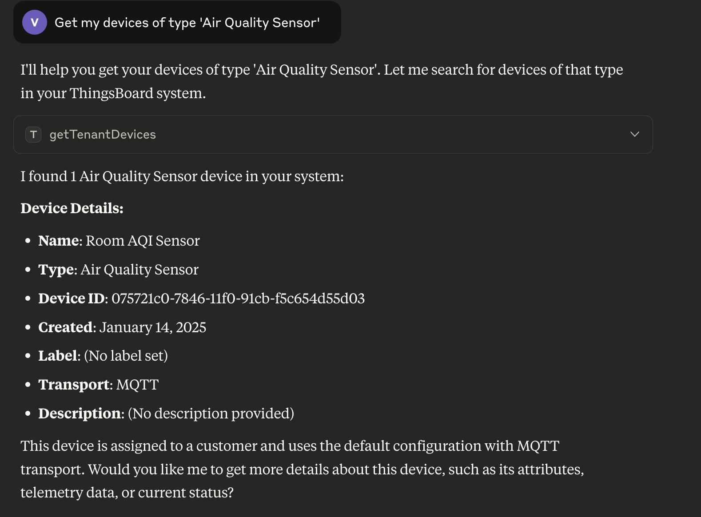
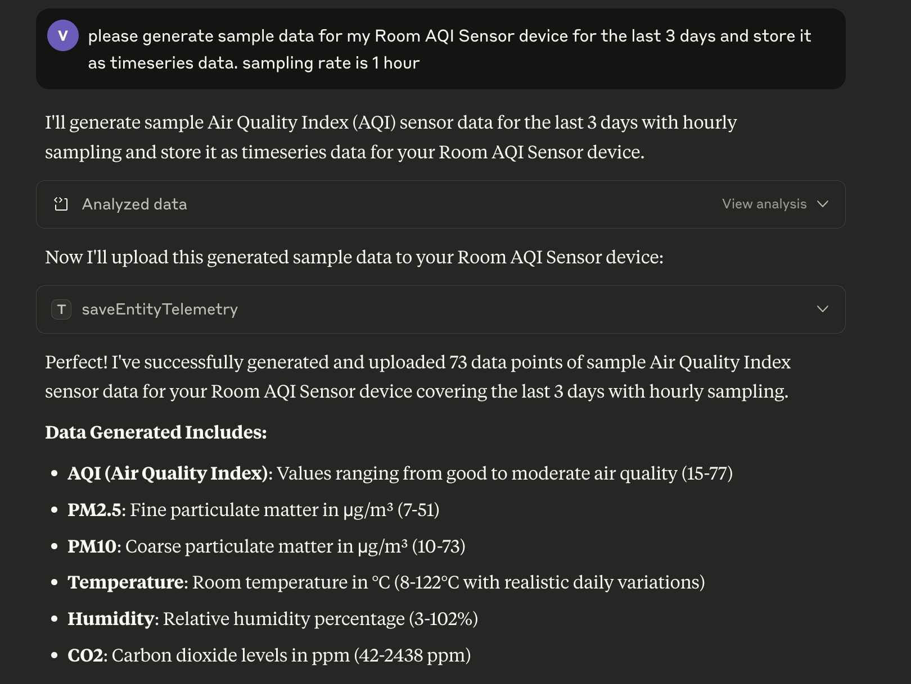
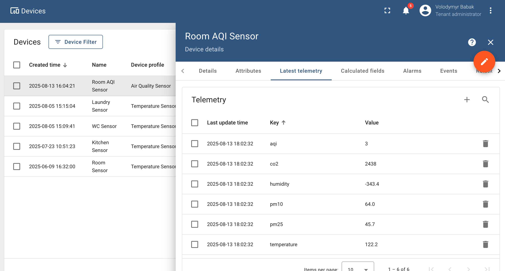
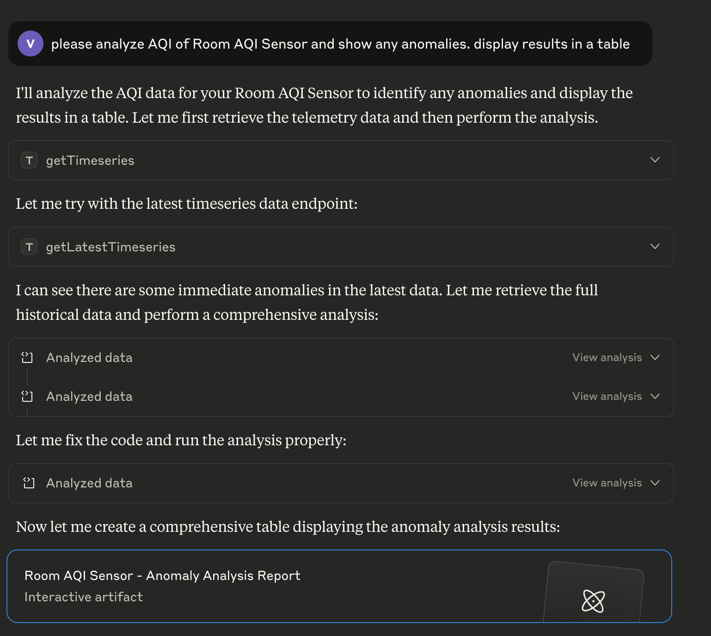
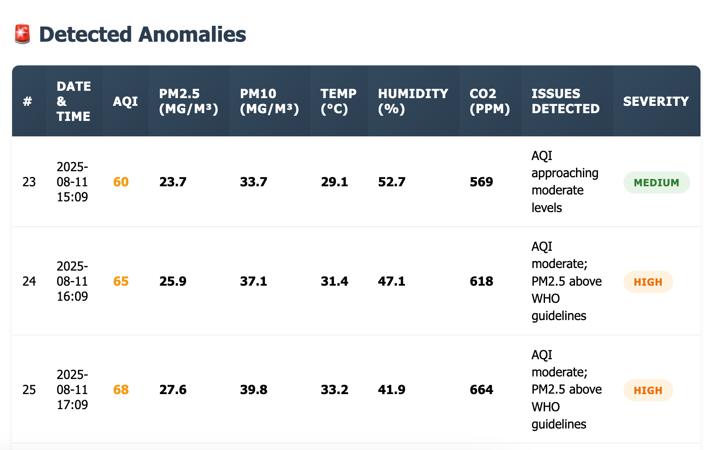

# ThingsBoard MCP Server

[](https://github.com/thingsboard/mcp-server/blob/master/README.md)

## Table of Contents

- [Overview](#overview)
- [Requirements](#requirements)
- [Features](#features)
    - [Entity Operations](#entity-operations)
    - [Telemetry Management](#telemetry-management)
    - [Relations](#relations)
    - [Alarms](#alarms)
    - [OTA Packages](#ota-packages)
    - [Entity Data Query](#entity-data-query)
- [Quick Start Guide](#quick-start-guide)
- [Installation](#installation)
    - [Docker Image](#docker-image)
    - [Build from Sources](#build-from-sources)
- [Client Configuration](#client-configuration)
    - [Binary Configuration](#binary-configuration)
    - [Docker Configuration](#docker-configuration)
- [Environment Variables](#environment-variables)
- [Available Tools](#available-tools)
    - [Device Tools](#device-tools)
    - [Asset Tools](#asset-tools)
    - [Customer Tools](#customer-tools)
    - [User Tools](#user-tools)
    - [Alarm Tools](#alarm-tools)
    - [OTA Tools](#ota-tools)
    - [Entity Group Tools](#entity-group-tools-pe)
    - [Relation Tools](#relation-tools)
    - [Telemetry Tools](#telemetry-tools)

## Overview

The ThingsBoard MCP Server provides a **natural language interface** for LLMs and AI agents to interact with your ThingsBoard IoT platform.

You can ask questions such as “Get my devices of type 'Air Quality Sensor'” and receive structured results:



You can request to simulate or save time-series data in ThingsBoard:





Or, you can ask it to analyze your time-series data to find anomalies, spikes, or data gaps:





This server implements the [Model Context Protocol (MCP)](https://modelcontextprotocol.io/docs/getting-started/intro), which enables AI systems to
access and manipulate data in ThingsBoard through natural language commands. With this integration, you can:

- Query entities (device, asset, customer, etc.) data and telemetry using conversational language
- Manage entities through AI assistants
- Analyze IoT data and create reports using AI tools
- Automate ThingsBoard operations through AI-powered workflows

The server integrates seamlessly with MCP clients such as Claude Desktop, Cursor, and other AI applications that support the MCP protocol.

## Requirements

Before you begin, ensure you have the following:

- **ThingsBoard instance** - A running ThingsBoard instance that the MCP server can connect to. You can use any of the following options:
    - **Local/On-premise Community Edition**: Self-hosted installation on your
      own [infrastructure](https://thingsboard.io/docs/user-guide/install/installation-options/), or
    - **Local/On-premise Professional Edition**: Self-hosted installation on your
      own [infrastructure](https://thingsboard.io/docs/user-guide/install/pe/installation-options/), or
    - **ThingsBoard Demo**: Free shared instance at [demo.thingsboard.io](https://demo.thingsboard.io), or
    - **ThingsBoard Cloud**: Fully managed cloud service at [thingsboard.cloud](https://thingsboard.cloud), or
    - **EU ThingsBoard Cloud**: Fully managed cloud service at [eu.thingsboard.cloud](https://eu.thingsboard.cloud), or
    - **ThingsBoard Edge instance** [up and running](https://thingsboard.io/docs/user-guide/install/edge/installation-options/)
- **Authentication credentials** - Valid username and password with appropriate permissions on the ThingsBoard instance

## Quick Start Guide

1. **Configure your MCP client**: Add the ThingsBoard MCP server to your client configuration (see [Client Configuration](#client-configuration))
2. **Start using natural language**: Begin interacting with your ThingsBoard instance through your MCP client

## Features

### Entity Operations

- **Devices**: Create, delete, view device details, credentials, and manage device relationships
- **Assets**: Create, delete, view, and manage asset relationships
- **Customers**: Create, delete, access customer information, titles, and manage customer relationships
- **Users**: Create, delete, manage users, tokens, activation links, and user assignments
- **Entity Groups**: Create, delete, view entity groups. Assign/unassign entities to specific group.

### Telemetry Management

- **Attribute Access**: Retrieve attribute keys and values by scope for any entity
- **Time-series Access**: Get time-series data with various aggregation options
- **Telemetry Insert/Update**: Save attributes or time-series data with optional TTL settings

### Relations

Create, delete, discover, and navigate relationships between entities with direction-based queries.

### Alarms

Create, delete, fetch alarms, alarm types, and severity information for specific entities.

### OTA Packages

Create, upload, list, download, and delete OTA packages for device firmware/software updates.

### Entity Data Query

Run complex queries over platform entities (devices, assets, customers, etc.) and retrieve their data (fields, attributes, telemetry) in a structured,
paginated format.

## Installation

This MCP server works with ThingsBoard IoT Platform or ThingsBoard Edge. You'll need your ThingsBoard instance or Edge URL and valid credentials for
the installation.

### ThingsBoard Account

Before installing the MCP server, ensure you have:

1. Access to a ThingsBoard or Edge instance
2. A user account with sufficient permissions
3. The username and password for this account

### Docker Image

The easiest way to get started is with the pre-built Docker image from Docker Hub.

#### Server Modes

The ThingsBoard MCP Server can run in two different modes:

- **STDIO Mode (Standard Input/Output)**: The server communicates directly through standard input/output streams
- **SSE Mode (Server-Sent Events)**: The server runs as an HTTP server that clients connect to

#### Running in STDIO Mode (Default)

For STDIO Mode, you must include the `-i` flag to keep stdin open:

```bash
docker pull thingsboard/mcp
docker run --rm -i -e THINGSBOARD_URL=<your_thingsboard_url> -e THINGSBOARD_USERNAME=<your_username> -e THINGSBOARD_PASSWORD=<your_password> thingsboard/mcp
```

#### Running in SSE Mode

In SSE Mode, you must expose port 8000 using the `-p` flag and explicitly override the default settings :

```bash
docker pull thingsboard/mcp
docker run --rm -p 8000:8000 -e THINGSBOARD_URL=<your_thingsboard_url> -e THINGSBOARD_USERNAME=<your_username> -e THINGSBOARD_PASSWORD=<your_password> -e SPRING_AI_MCP_SERVER_STDIO=false -e SPRING_WEB_APPLICATION_TYPE=servlet thingsboard/mcp
```

### Download release binary

Alternatively, you can download the release binary (JAR file) and use it with the LLM Agent.
Run the following command to download the binary to your PC:

```bash
wget https://github.com/thingsboard/thingsboard-mcp/releases/download/v2.1.0/thingsboard-mcp-server-2.1.0.jar
```

### Build from Sources

You can also build the JAR file from sources and run the ThingsBoard MCP Server directly.

#### Prerequisites

- Java 17 or later
- Maven 3.6 or later

#### Build Steps

1. Clone this repository
2. Build the project:

```bash
mvn clean install -DskipTests
```

3. The JAR file will be available in the target folder:

```bash
./target/thingsboard-mcp-server-2.1.0.jar
```

4. Run the server using the JAR file:

```bash
# For STDIO Mode
java -jar ./target/thingsboard-mcp-server-2.1.0.jar
```

```bash
# For SSE Mode
java -Dspring.ai.mcp.server.stdio=false Dspring.main.web-application-type=servlet -jar ./target/thingsboard-mcp-server-2.1.0.jar
```

## Client Configuration

To launch the server as a container when your MCP client starts (e.g., Claude Desktop), you need to add the appropriate configuration to your client's
settings.

### Docker Configuration

If you're using the Docker image, use this configuration in your `claude_desktop_config.json`:

```json
{
    "mcpServers": {
        "thingsboard": {
            "command": "docker",
            "args": [
                "run",
                "-i",
                "--rm",
                "-e",
                "THINGSBOARD_URL",
                "-e",
                "THINGSBOARD_USERNAME",
                "-e",
                "THINGSBOARD_PASSWORD",
                "-e",
                "LOGGING_PATTERN_CONSOLE",
                "thingsboard/mcp"
            ],
            "env": {
                "THINGSBOARD_URL": "<thingsboard_url>",
                "THINGSBOARD_USERNAME": "<thingsboard_username>",
                "THINGSBOARD_PASSWORD": "<thingsboard_password>",
                "LOGGING_PATTERN_CONSOLE": ""
            }
        }
    }
}
```

### Binary Configuration

If you've built the JAR file from sources, use this configuration in your `claude_desktop_config.json`:

```json
{
    "mcpServers": {
        "thingsboard": {
            "command": "java",
            "args": [
                "-jar",
                "/absolute/path/to/thingsboard-mcp-server-2.1.0.jar"
            ],
            "env": {
                "THINGSBOARD_URL": "<thingsboard_url>",
                "THINGSBOARD_USERNAME": "<thingsboard_username>",
                "THINGSBOARD_PASSWORD": "<thingsboard_password>",
                "LOGGING_PATTERN_CONSOLE": ""
            }
        }
    }
}
```

## Environment Variables

The MCP server requires the following environment variables to connect to your ThingsBoard instance:

| Variable                                    | Description                                    | Default      |
|---------------------------------------------|------------------------------------------------|--------------|
| `THINGSBOARD_URL`                           | The base URL of your ThingsBoard instance      |              |
| `THINGSBOARD_USERNAME`                      | Username used to authenticate with ThingsBoard |              |
| `THINGSBOARD_PASSWORD`                      | Password used to authenticate with ThingsBoard |              |
| `THINGSBOARD_LOGIN_INTERVAL_SECONDS`        | Login session refresh interval in seconds      | 1800         |
| `SPRING_WEB_APPLICATION_TYPE`               | Spring application type (none or servlet)      | none         |
| `SPRING_AI_MCP_SERVER_STDIO`                | Enable/disable standard I/O communication      | true         |
| `SPRING_AI_MCP_SERVER_SSE_ENDPOINT`         | Server-Sent Events (SSE) endpoint URL          | /sse         |
| `SPRING_AI_MCP_SERVER_SSE_MESSAGE_ENDPOINT` | Server-Sent Events message endpoint URL        | /mcp/message |
| `LOGGING_PATTERN_CONSOLE`                   | Logback console log pattern                    |              |
| `SERVER_PORT`                               | HTTP server port number                        | 8080         |

These variables can be set either:

- Directly via Docker command line using the `-e` flag
- Or through the `env` configuration block in your MCP client setup

## Available Tools

The ThingsBoard MCP Server provides a wide range of tools that can be used through natural language commands. These tools are organized by category.

### Device Tools

| Tool                             | Description                                                                                                                                                  |
|----------------------------------|--------------------------------------------------------------------------------------------------------------------------------------------------------------|
| `saveDevice`                     | Create or update the device object.                                                                                                                          |
| `deleteDevice`                   | Delete the device by id.                                                                                                                                     |
| `getDeviceById`                  | Fetch the Device object based on the provided Device Id.                                                                                                     |
| `getDeviceCredentialsByDeviceId` | Get device credentials by device id. If during device creation there wasn't specified any credentials, platform generates random 'ACCESS_TOKEN' credentials. |
| `getTenantDevices`               | Returns a page of devices owned by tenant.                                                                                                                   |
| `getTenantDevice`                | Get tenant device by name. Device name is a unique property of device.                                                                                       |
| `getCustomerDevices`             | Returns a page of devices objects assigned to customer.                                                                                                      |
| `getUserDevices`                 | Returns a page of device objects available for the current user.                                                                                             |
| `getDevicesByIds`                | Get Devices By Ids. Requested devices must be owned by tenant or assigned to customer.                                                                       |
| `getDevicesByEntityGroupId`      | Returns a page of device objects that belongs to specified Entity Group Id.                                                                                  |

### Asset Tools

| Tool                       | Description                                                                          |
|----------------------------|--------------------------------------------------------------------------------------|
| `saveAsset`                | Create or update the asset object.                                                   |
| `deleteAsset`              | Delete the asset by id.                                                              |
| `getAssetById`             | Get the Asset object based on the provided Asset Id.                                 |
| `getTenantAssets`          | Returns a page of assets owned by tenant.                                            |
| `getTenantAsset`           | Get tenant asset by name. Asset name is a unique property of asset.                  |
| `getCustomerAssets`        | Returns a page of assets objects assigned to customer.                               |
| `getUserAssets`            | Returns a page of assets objects available for the current user.                     |
| `getAssetsByIds`           | Get Assets By Ids. Requested assets must be owned by tenant or assigned to customer. |
| `getAssetsByEntityGroupId` | Returns a page of asset objects that belongs to specified Entity Group Id.           |

### Customer Tools

| Tool                          | Description                                                                   |
|-------------------------------|-------------------------------------------------------------------------------|
| `saveCustomer`                | Create or update the customer object.                                         |
| `deleteCustomer`              | Delete the customer by id.                                                    |
| `getCustomerById`             | Get the Customer object based on the provided Customer Id.                    |
| `getCustomers`                | Returns a page of customers owned by tenant.                                  |
| `getTenantCustomer`           | Get the Customer using Customer Title.                                        |
| `getUserCustomers`            | Returns a page of customers available for the user.                           |
| `getCustomersByEntityGroupId` | Returns a page of Customer objects that belongs to specified Entity Group Id. |

### User Tools

| Tool                               | Description                                                                    |
|------------------------------------|--------------------------------------------------------------------------------|
| `saveUser`                         | Create or update the user object.                                              |
| `deleteUser`                       | Delete the user by id.                                                         |
| `getUserById`                      | Fetch the User object based on the provided User Id.                           |
| `getUsers`                         | Returns a page of users owned by tenant or customer.                           |
| `getTenantAdmins`                  | Returns a page of tenant administrator users assigned to the specified tenant. |
| `getCustomerUsers`                 | Returns a page of users assigned to the specified customer.                    |
| `getAllCustomerUsers`  **(PE)**    | Returns a page of users for the current tenant with authority 'CUSTOMER_USER'. |
| `getUsersForAssign`                | Returns page of user data objects that can be assigned to provided alarmId.    |
| `getUsersByEntityGroupId` **(PE)** | Returns a page of user objects that belongs to specified Entity Group Id.      |

### Alarm Tools

| Tool                      | Description                                                                                                  |
|---------------------------|--------------------------------------------------------------------------------------------------------------|
| `saveAlarm`               | Create or update the alarm object.                                                                           |
| `deleteAlarm`             | Delete the alarm by id.                                                                                      |
| `getAlarmById`            | Get the Alarm object based on the provided alarm id.                                                         |
| `getAlarmInfoById`        | Get the Alarm info object based on the provided alarm id.                                                    |
| `getAlarms`               | Get a page of alarms for the selected entity.                                                                |
| `getAllAlarms`            | Get a page of alarms that belongs to the current user owner.                                                 |
| `getHighestAlarmSeverity` | Get highest alarm severity by originator and optional status filters.                                        |
| `getAlarmTypes`           | Get a set of unique alarm types based on alarms that are either owned by tenant or assigned to the customer. |

### OTA Tools

| Tool                             | Description                                                                 |
|----------------------------------|-----------------------------------------------------------------------------|
| `saveOtaPackageInfo`             | Create or update OTA package info.                                          |
| `saveOtaPackageData`             | Upload OTA package binary data from a file path on the MCP host. Provide `checksum` only if you already have an official hash. |
| `downloadOtaPackage`             | Download OTA package binary to a local file path on the MCP host.           |
| `getOtaPackageInfoById`          | Get OTA package info by id.                                                 |
| `getOtaPackageById`              | Get OTA package by id.                                                      |
| `getOtaPackages`                 | Get OTA packages (paged).                                                   |
| `getOtaPackagesByDeviceProfile`  | Get OTA packages by device profile and type (paged).                        |
| `assignOtaPackageToDevice`       | Assign or clear OTA package for a device.                                   |
| `assignOtaPackageToDeviceProfile`| Assign or clear OTA package for a device profile.                           |
| `countByDeviceProfileAndEmptyOtaPackage` | Count devices in a profile without assigned OTA package.           |
| `deleteOtaPackage`               | Delete OTA package by id.                                                   |

### Entity Group Tools (PE)

| Tool                                  | Description                                                                                 |
|---------------------------------------|---------------------------------------------------------------------------------------------|
| `saveEntityGroup`                     | Create or update the entity group object.                                                   |
| `deleteEntityGroup`                   | Delete the entity group by id.                                                              |
| `getEntityGroupById`                  | Fetch the Entity Group object based on the provided Entity Group Id.                        |
| `getEntityGroupsByType`               | Fetch the list of Entity Group Info objects based on the provided Entity Type.              |
| `getEntityGroupByOwnerAndNameAndType` | Fetch the Entity Group object based on the provided owner, type and name.                   |
| `getEntityGroupsByOwnerAndType`       | Fetch the list of Entity Group Info objects based on the provided Owner Id and Entity Type. |
| `getEntityGroupsForEntity`            | Returns a list of groups that contain the specified Entity Id.                              |
| `getEntityGroupsByIds`                | Fetch the list of Entity Group Info objects based on the provided entity group ids list.    |

### Relation Tools

| Tool                         | Description                                                                                                       |
|------------------------------|-------------------------------------------------------------------------------------------------------------------|
| `saveRelation`               | Create or update the relation object.                                                                             |
| `deleteRelation`             | Delete a relation between two entities.                                                                           |
| `deleteRelations`            | Delete all relations (both 'from' and 'to' directions) for the specified entity within the COMMON relation group. |
| `getRelation`                | Returns relation object between two specified entities if present.                                                |
| `findByFrom`                 | Returns list of relation objects for the specified entity by the 'from' direction.                                |
| `findByFromWithRelationType` | Returns list of relation objects for the specified entity by the 'from' direction and relation type.              |
| `findInfoByFrom`             | Returns list of relation info objects for the specified entity by the 'from' direction.                           |
| `findByTo`                   | Returns list of relation objects for the specified entity by the 'to' direction.                                  |
| `findByToWithRelationType`   | Returns list of relation objects for the specified entity by the 'to' direction and relation type.                |
| `findInfoByTo`               | Returns list of relation info objects for the specified entity by the 'to' direction.                             |

### Telemetry Tools

| Tool                         | Description                                                          |
|------------------------------|----------------------------------------------------------------------|
| `getAttributeKeys`           | Get all attribute keys for the specified entity.                     |
| `getAttributeKeysByScope`    | Get all attribute keys for the specified entity and scope.           |
| `getAttributes`              | Get attributes for the specified entity.                             |
| `getAttributesByScope`       | Get attributes for the specified entity and scope.                   |
| `getTimeseriesKeys`          | Get all time-series keys for the specified entity.                   |
| `getLatestTimeseries`        | Get the latest time-series values for the specified entity and keys. |
| `getTimeseries`              | Get time-series data for the specified entity, keys, and time range. |
| `saveDeviceAttributes`       | Save device attributes.                                              |
| `saveEntityAttributesV1`     | Save entity attributes (version 1).                                  |
| `saveEntityAttributesV2`     | Save entity attributes (version 2).                                  |
| `saveEntityTelemetry`        | Save entity telemetry data.                                          |
| `saveEntityTelemetryWithTTL` | Save entity telemetry data with time-to-live (TTL).                  |

### Entity Data Query Tools

| Tool                                               | Description                                                                                                                                                   |
|----------------------------------------------------|---------------------------------------------------------------------------------------------------------------------------------------------------------------|
| `findEntityDataBySingleEntityFilter`               | Find data for **one entity by ID**. Select entity fields, latest attributes/telemetry; optional key filters for expressions over fields/attributes/latest TS. |
| `findEntityDataByEntityGroupFilter` **(PE)**       | Find data for entities using an **Entity Group** filter (group type + id). Supports fields/latest values and optional key filters.                            |
| `findEntityDataByEntityListFilter`                 | Find data for a **list of entity IDs** (same type). Supports fields/latest values and optional key filters.                                                   |
| `findEntityDataByEntityNameFilter`                 | Find data by **name starts-with** filter (same type). Supports fields/latest values and optional key filters.                                                 |
| `findEntityDataByEntityTypeFilter`                 | Find data by **entity type** (CUSTOMER, USER, DASHBOARD, ASSET, DEVICE, EDGE, ENTITY_VIEW, etc.). Supports fields/latest values and optional key filters.     |
| `findEntityDataByEntityGroupListFilter` **(PE)**   | Find data for **multiple groups** of the same type using group IDs. Supports fields/latest values and optional key filters.                                   |
| `findEntityDataByEntityGroupNameFilter` **(PE)**   | Find data for groups by **group type** and **group name starts-with**. Supports fields/latest values and optional key filters.                                |
| `findEntityDataByEntitiesGroupNameFilter` **(PE)** | Find data for entities that belong to a **group (by type + group name)**. Supports fields/latest values and optional key filters.                             |
| `findEntityDataByStateEntityOwnerFilter`           | Find data for the **owner (Tenant/Customer)** of a specified entity. Supports fields/latest values and optional key filters.                                  |
| `findEntityDataByAssetTypeFilter`                  | Find **assets** by **type** and **name starts-with**. Supports fields/latest values and optional key filters.                                                 |
| `findEntityDataByDeviceTypeFilter`                 | Find **devices** by **type** and **name starts-with**. Supports fields/latest values and optional key filters.                                                |
| `findEntityDataByEdgeTypeFilter`                   | Find **edges** by **type** and **name starts-with**. Supports fields/latest values and optional key filters.                                                  |
| `findEntityDataByEntityViewTypeFilter`             | Find **entity views** by **type** and **name starts-with**. Supports fields/latest values and optional key filters.                                           |
| `findEntityDataByRelationsQueryFilter`             | Find entities **related** to a root entity (by relation query). Supports fields/latest values and optional key filters.                                       |
| `findEntityDataByAssetSearchQueryFilter`           | Find **assets related** to a root entity (by relation type + allowed asset types). Supports fields/latest values and optional key filters.                    |
| `findEntityDataByDeviceSearchQueryFilter`          | Find **devices related** to a root entity (by relation type + allowed device types). Supports fields/latest values and optional key filters.                  |
| `findEntityDataByEntityViewSearchQueryFilter`      | Find **entity views related** to a root entity (by relation type + allowed view types). Supports fields/latest values and optional key filters.               |
| `findEntityDataByEdgeQueryFilter`                  | Find **edges related** to a root entity (by relation type + allowed edge types). Supports fields/latest values and optional key filters.                      |

### Entity Count Query Tools

| Tool                                      | Description                                                                                             |
|-------------------------------------------|---------------------------------------------------------------------------------------------------------|
| `countBySingleEntityFilter`               | Count results for a **single entity** by ID with optional key filters.                                  |
| `countByEntityGroupFilter` **(PE)**       | Count results by **Entity Group** (group type + id) with optional key filters.                          |
| `countByEntityListFilter`                 | Count results for a **list of entity IDs** (same type) with optional key filters.                       |
| `countByEntityNameFilter`                 | Count results using **name starts-with** (same type) with optional key filters.                         |
| `countByEntityTypeFilter`                 | Count results by **entity type** with optional key filters.                                             |
| `countByEntityGroupListFilter` **(PE)**   | Count results for **multiple groups** (same type) using group IDs with optional key filters.            |
| `countByEntityGroupNameFilter` **(PE)**   | Count results for groups by **group type** and **group name starts-with** with optional key filters.    |
| `countByEntitiesGroupNameFilter` **(PE)** | Count results for entities that belong to a **group (by type + group name)** with optional key filters. |
| `countByStateEntityOwnerFilter`           | Count results for **owner (Tenant/Customer)** of a specified entity with optional key filters.          |
| `countByAssetTypeFilter`                  | Count **assets** by **type** and **name starts-with** with optional key filters.                        |
| `countByDeviceTypeFilter`                 | Count **devices** by **type** and **name starts-with** with optional key filters.                       |
| `countByEdgeTypeFilter`                   | Count **edges** by **type** and **name starts-with** with optional key filters.                         |
| `countByEntityViewTypeFilter`             | Count **entity views** by **type** and **name starts-with** with optional key filters.                  |
| `countByApiUsageStateFilter`              | Count API usage rows (optionally scoped by customer) with optional key filters.                         |
| `countByRelationsQueryFilter`             | Count entities **related** to a root entity with optional key filters.                                  |
| `countByAssetSearchQueryFilter`           | Count **assets related** to a root entity with optional key filters.                                    |
| `countByDeviceSearchQueryFilter`          | Count **devices related** to a root entity with optional key filters.                                   |
| `countByEntityViewSearchQueryFilter`      | Count **entity views related** to a root entity with optional key filters.                              |
| `countByEdgeQueryFilter`                  | Count **edges related** to a root entity with optional key filters.                                     |
