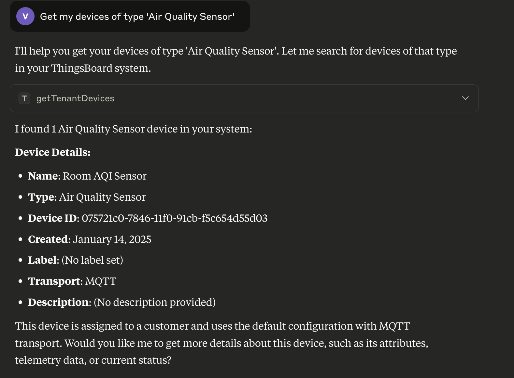
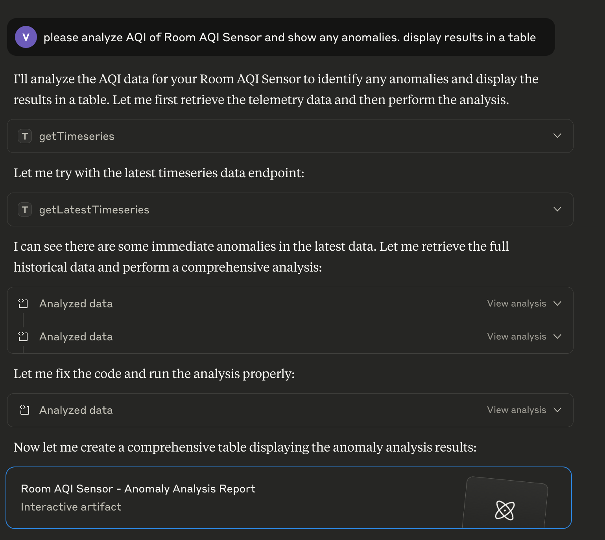
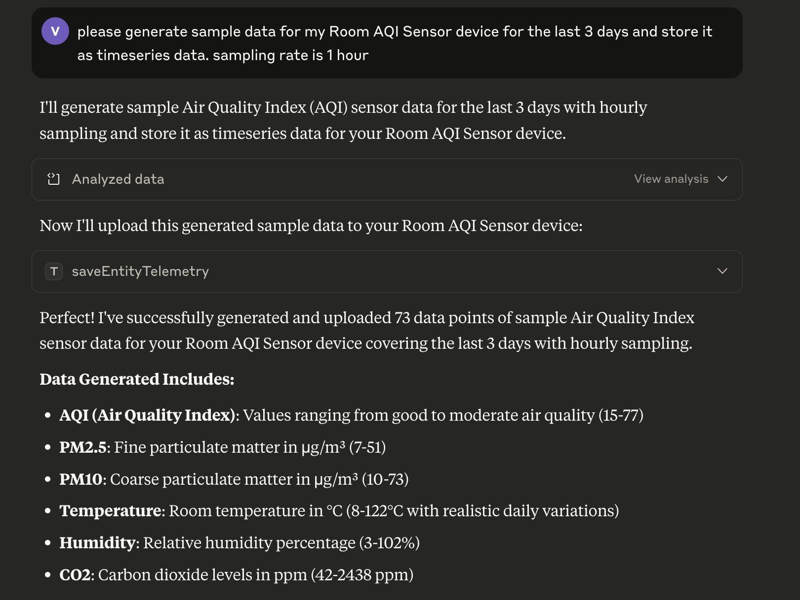
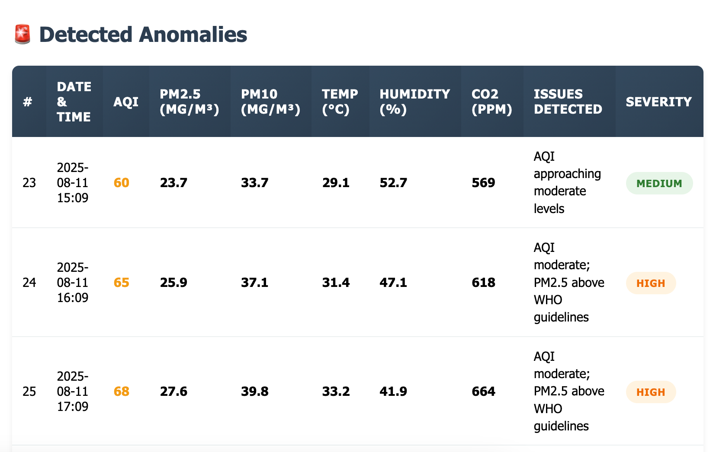

# ThingsBoard MCP Server

[](https://github.com/thingsboard/mcp-server/blob/master/LICENSE)
[](https://hub.docker.com/r/thingsboard/mcp)
[](https://github.com/thingsboard/mcp-server)

Connect AI agents to your [ThingsBoard](https://thingsboard.io) IoT platform via [Model Context Protocol (MCP)](https://modelcontextprotocol.io). Query devices, manage entities, analyze telemetry, and automate operations — all through natural language.

Works with Claude Desktop, Cursor, VS Code Copilot, Claude Code, and any MCP-compatible client.

## Quick Start

You need a ThingsBoard instance ([Cloud](https://thingsboard.cloud), [EU Cloud](https://eu.thingsboard.cloud), [self-hosted CE/PE](https://thingsboard.io/docs/user-guide/install/installation-options/), or [Edge](https://thingsboard.io/docs/user-guide/install/edge/installation-options/)) and an API key (ThingsBoard 4.3+) or username/password.

<details open>
<summary><b>Claude Desktop</b></summary>

Add to your `claude_desktop_config.json`:

```json
{
  "mcpServers": {
    "thingsboard": {
      "command": "docker",
      "args": ["run", "-i", "--rm", "-e", "THINGSBOARD_URL", "-e", "THINGSBOARD_API_KEY", "thingsboard/mcp"],
      "env": {
        "THINGSBOARD_URL": "https://thingsboard.cloud",
        "THINGSBOARD_API_KEY": "YOUR_API_KEY"
      }
    }
  }
}
```

</details>

<details>
<summary><b>Cursor</b></summary>

Add to `~/.cursor/mcp.json` (global) or `.cursor/mcp.json` (project):

```json
{
  "mcpServers": {
    "thingsboard": {
      "command": "docker",
      "args": ["run", "-i", "--rm", "-e", "THINGSBOARD_URL", "-e", "THINGSBOARD_API_KEY", "thingsboard/mcp"],
      "env": {
        "THINGSBOARD_URL": "https://thingsboard.cloud",
        "THINGSBOARD_API_KEY": "YOUR_API_KEY"
      }
    }
  }
}
```

</details>

<details>
<summary><b>VS Code Copilot</b></summary>

Add to your VS Code `settings.json` or `.vscode/mcp.json`:

```json
{
  "mcp": {
    "servers": {
      "thingsboard": {
        "command": "docker",
        "args": ["run", "-i", "--rm", "-e", "THINGSBOARD_URL", "-e", "THINGSBOARD_API_KEY", "thingsboard/mcp"],
        "env": {
          "THINGSBOARD_URL": "https://thingsboard.cloud",
          "THINGSBOARD_API_KEY": "YOUR_API_KEY"
        }
      }
    }
  }
}
```

</details>

<details>
<summary><b>Claude Code</b></summary>

```bash
claude mcp add thingsboard \
  -e THINGSBOARD_URL=https://thingsboard.cloud \
  -e THINGSBOARD_API_KEY=YOUR_API_KEY \
  -- docker run -i --rm -e THINGSBOARD_URL -e THINGSBOARD_API_KEY thingsboard/mcp
```

</details>

<details>
<summary><b>SSE Mode (any HTTP-based MCP client)</b></summary>

Start the server:

```bash
docker run --rm -p 8000:8000 \
  -e THINGSBOARD_URL=https://thingsboard.cloud \
  -e THINGSBOARD_API_KEY=YOUR_API_KEY \
  -e SPRING_AI_MCP_SERVER_STDIO=false \
  -e SPRING_WEB_APPLICATION_TYPE=servlet \
  thingsboard/mcp
```

Then point your MCP client to `http://localhost:8000/sse`.

</details>

> **Legacy auth**: If your ThingsBoard version is older than 4.3, use `THINGSBOARD_USERNAME` and `THINGSBOARD_PASSWORD` instead of `THINGSBOARD_API_KEY`.

## What You Can Do

Ask questions in natural language and get structured results from your ThingsBoard instance:

| | |
|---|---|
| **Query devices and entities** | **Analyze time-series data** |
|  |  |
| **Generate and save telemetry** | **Get anomaly analysis** |
|  |  |

**120+ tools** across 10 tool groups:

- **Devices** — create, update, delete, list, search by name/type/group
- **Assets** — CRUD, list by tenant/customer, search
- **Customers** — CRUD, list, search by title
- **Users** — CRUD, list, admin/customer user management
- **Alarms** — create, acknowledge, clear, delete, query by severity
- **Telemetry** — read/write attributes and time-series, aggregation, TTL
- **Relations** — create, delete, navigate entity relationships
- **OTA Packages** — upload, download, assign firmware/software to devices
- **Entity Groups** (PE) — manage groups, assign/remove entities
- **Entity Data Query** — complex filtered queries across all entity types with attribute/telemetry filters

## Installation

### Docker (Recommended)

```bash
docker pull thingsboard/mcp
```

The Docker image supports two transport modes:

- **STDIO** (default) — for clients that launch the server as a subprocess (Claude Desktop, Cursor, etc.)
- **SSE** — for clients that connect over HTTP

See [Quick Start](#quick-start) for usage examples.

### Download Binary

```bash
wget https://github.com/thingsboard/mcp-server/releases/download/v2.2.0/thingsboard-mcp-server-2.2.0.jar
```

Run with:

```bash
# STDIO mode
java -jar thingsboard-mcp-server-2.2.0.jar

# SSE mode
java -Dspring.ai.mcp.server.stdio=false -Dspring.main.web-application-type=servlet -jar thingsboard-mcp-server-2.2.0.jar
```

<details>
<summary><b>Binary client configuration</b></summary>

If you're using the JAR file instead of Docker, use this in your `claude_desktop_config.json`:

```json
{
  "mcpServers": {
    "thingsboard": {
      "command": "java",
      "args": ["-jar", "/absolute/path/to/thingsboard-mcp-server-2.2.0.jar"],
      "env": {
        "THINGSBOARD_URL": "https://thingsboard.cloud",
        "THINGSBOARD_API_KEY": "YOUR_API_KEY"
      }
    }
  }
}
```

</details>

### Build from Source

Requires Java 25+ and Maven 3.6+.

```bash
git clone https://github.com/thingsboard/mcp-server.git
cd mcp-server
mvn clean install -DskipTests
java -jar target/thingsboard-mcp-server-2.2.0.jar
```

## Configuration

### Environment Variables

| Variable | Description | Default |
|----------|-------------|---------|
| `THINGSBOARD_URL` | Base URL of your ThingsBoard instance | *required* |
| `THINGSBOARD_API_KEY` | API key for authentication (recommended for 4.3+) | |
| `THINGSBOARD_USERNAME` | Username for authentication (legacy) | |
| `THINGSBOARD_PASSWORD` | Password for authentication (legacy) | |
| `THINGSBOARD_LOGIN_INTERVAL_SECONDS` | Session refresh interval | `1800` |
| `HTTP_BIND_ADDRESS` | HTTP bind address (SSE mode) | `127.0.0.1` |
| `HTTP_BIND_PORT` | HTTP port (SSE mode) | `8000` |
| `SPRING_AI_MCP_SERVER_STDIO` | Enable STDIO transport | `true` |
| `SPRING_WEB_APPLICATION_TYPE` | `none` for STDIO, `servlet` for SSE | `none` |
| `SPRING_AI_MCP_SERVER_SSE_ENDPOINT` | SSE endpoint path | `/sse` |
| `SPRING_AI_MCP_SERVER_SSE_MESSAGE_ENDPOINT` | SSE message endpoint path | `/mcp/message` |

<details>
<summary><b>Advanced: connection and logging</b></summary>

| Variable | Description | Default |
|----------|-------------|---------|
| `THINGSBOARD_CONNECTION_MAX_RETRIES` | Max connection retry attempts | `3` |
| `THINGSBOARD_CONNECTION_RETRY_DELAY_SECONDS` | Delay between retries | `5` |
| `THINGSBOARD_CONNECTION_CONNECT_TIMEOUT_SECONDS` | HTTP connect timeout | `10` |
| `THINGSBOARD_CONNECTION_READ_TIMEOUT_SECONDS` | HTTP read timeout | `60` |
| `LOG_LEVEL_APP` | Application log level | `info` |
| `LOG_LEVEL_TOOLS` | Tool execution log level | `info` |
| `LOG_LEVEL_TOOL_RESPONSE` | Tool response log level | `info` |
| `LOGGING_PATTERN_CONSOLE` | Logback console pattern | `%d{yyyy-MM-dd HH:mm:ss} \| %-5level \| %logger{1} \| %msg%n` |
| `LOGGING_CONSOLE_TARGET` | Log output target | `System.err` |

</details>

### Tool Groups

The server exposes **120+ tools** which may exceed context limits for some clients. Disable groups you don't need:

| Variable | Group | Tools | Default |
|----------|-------|-------|---------|
| `THINGSBOARD_TOOLS_EDQ` | Entity Data Query + Guides | 40 | `true` |
| `THINGSBOARD_TOOLS_TELEMETRY` | Telemetry & Attributes | 11 | `true` |
| `THINGSBOARD_TOOLS_DEVICE` | Devices | 11 | `true` |
| `THINGSBOARD_TOOLS_ASSET` | Assets | 8 | `true` |
| `THINGSBOARD_TOOLS_ALARM` | Alarms | 9 | `true` |
| `THINGSBOARD_TOOLS_OTA` | OTA Packages | 11 | `true` |
| `THINGSBOARD_TOOLS_RELATION` | Relations | 8 | `true` |
| `THINGSBOARD_TOOLS_CUSTOMER` | Customers | 7 | `true` |
| `THINGSBOARD_TOOLS_USER` | Users | 9 | `true` |
| `THINGSBOARD_TOOLS_GROUP` | Entity Groups (PE only) | 10 | `true` |

**Example** — reduce to ~50 tools for clients with limited context:

```json
{
  "env": {
    "THINGSBOARD_TOOLS_EDQ": "false",
    "THINGSBOARD_TOOLS_OTA": "false",
    "THINGSBOARD_TOOLS_GROUP": "false",
    "THINGSBOARD_TOOLS_USER": "false"
  }
}
```

## Available Tools

<details>
<summary><b>Device Tools (11)</b></summary>

| Tool | Description |
|------|-------------|
| `createOrUpsertDevice` | Create or update a device by name. Primary tool for most device tasks. |
| `saveDevice` | Create or update the device object from raw JSON. Advanced tool. |
| `deleteDevice` | Delete the device by id. |
| `getDeviceById` | Fetch the Device object based on the provided Device Id. |
| `getDeviceCredentialsByDeviceId` | Get device credentials by device id. |
| `getTenantDevices` | Returns a page of devices owned by tenant. |
| `getTenantDevice` | Get tenant device by name. |
| `getCustomerDevices` | Returns a page of devices assigned to customer. |
| `getUserDevices` **(PE)** | Returns a page of devices available for the current user. |
| `getDevicesByIds` | Get devices by ids. |
| `getDevicesByEntityGroupId` **(PE)** | Returns a page of devices in a specified entity group. |

</details>

<details>
<summary><b>Asset Tools (8)</b></summary>

| Tool | Description |
|------|-------------|
| `saveAsset` | Create or update the asset object. |
| `deleteAsset` | Delete the asset by id. |
| `getAssetById` | Get the Asset object by id. |
| `getTenantAssets` | Returns a page of assets owned by tenant. |
| `getTenantAsset` | Get tenant asset by name. |
| `getCustomerAssets` | Returns a page of assets assigned to customer. |
| `getUserAssets` **(PE)** | Returns a page of assets available for the current user. |
| `getAssetsByEntityGroupId` **(PE)** | Returns a page of assets in a specified entity group. |

</details>

<details>
<summary><b>Customer Tools (7)</b></summary>

| Tool | Description |
|------|-------------|
| `saveCustomer` | Create or update the customer object. |
| `deleteCustomer` | Delete the customer by id. |
| `getCustomerById` | Get the Customer object by id. |
| `getCustomers` | Returns a page of customers owned by tenant. |
| `getTenantCustomer` | Get customer by title. |
| `getUserCustomers` **(PE)** | Returns a page of customers available for the user. |
| `getCustomersByEntityGroupId` **(PE)** | Returns a page of customers in a specified entity group. |

</details>

<details>
<summary><b>User Tools (9)</b></summary>

| Tool | Description |
|------|-------------|
| `saveUser` | Create or update the user object. |
| `deleteUser` | Delete the user by id. |
| `getUserById` | Fetch the User object by id. |
| `getUsers` | Returns a page of users owned by tenant or customer. |
| `getTenantAdmins` | Returns a page of tenant administrator users. |
| `getCustomerUsers` | Returns a page of users assigned to a customer. |
| `getAllCustomerUsers` **(PE)** | Returns a page of all customer users for the current tenant. |
| `getUsersForAssign` | Returns users that can be assigned to an alarm. |
| `getUsersByEntityGroupId` **(PE)** | Returns a page of users in a specified entity group. |

</details>

<details>
<summary><b>Alarm Tools (9)</b></summary>

| Tool | Description |
|------|-------------|
| `saveAlarm` | Create or update the alarm object. |
| `deleteAlarm` | Delete the alarm by id. |
| `ackAlarm` | Acknowledge the alarm. |
| `clearAlarm` | Clear the alarm. |
| `getAlarmInfoById` | Get alarm info by id (includes originator name). |
| `getAlarms` | Get a page of alarms for the selected entity. |
| `getAllAlarms` | Get a page of alarms for the current user owner. |
| `getHighestAlarmSeverity` | Get highest alarm severity by originator. |
| `getAlarmTypes` | Get unique alarm types. |

</details>

<details>
<summary><b>OTA Tools (11)</b></summary>

| Tool | Description |
|------|-------------|
| `saveOtaPackageInfo` | Create or update OTA package info. |
| `saveOtaPackageData` | Upload OTA package binary from a file path. |
| `downloadOtaPackage` | Download OTA package binary to a local file path. |
| `getOtaPackageInfoById` | Get OTA package info by id. |
| `getOtaPackageById` | Get OTA package by id. |
| `getOtaPackages` | Get OTA packages (paged). |
| `getOtaPackagesByDeviceProfile` | Get OTA packages by device profile and type. |
| `assignOtaPackageToDevice` | Assign or clear OTA package for a device. |
| `assignOtaPackageToDeviceProfile` | Assign or clear OTA package for a device profile. |
| `countByDeviceProfileAndEmptyOtaPackage` | Count devices without assigned OTA package. |
| `deleteOtaPackage` | Delete OTA package by id. |

</details>

<details>
<summary><b>Relation Tools (8)</b></summary>

| Tool | Description |
|------|-------------|
| `saveRelation` | Create or update a relation. |
| `deleteRelation` | Delete a relation between two entities. |
| `deleteRelations` | Delete all relations for an entity. |
| `getRelation` | Get a relation between two entities. |
| `findInfoByFrom` | Find relations from an entity (includes entity names). |
| `findByFromWithRelationType` | Find relations from an entity filtered by type. |
| `findInfoByTo` | Find relations to an entity (includes entity names). |
| `findByToWithRelationType` | Find relations to an entity filtered by type. |

</details>

<details>
<summary><b>Telemetry Tools (11)</b></summary>

| Tool | Description |
|------|-------------|
| `getAttributeKeys` | Get all attribute keys for an entity. |
| `getAttributeKeysByScope` | Get attribute keys by scope. |
| `getAttributes` | Get attributes for an entity. |
| `getAttributesByScope` | Get attributes by scope. |
| `getTimeseriesKeys` | Get all time-series keys for an entity. |
| `getLatestTimeseries` | Get latest time-series values. |
| `getTimeseries` | Get time-series data for a time range. |
| `saveDeviceAttributes` | Save device attributes. |
| `saveEntityAttributesV2` | Save entity attributes. |
| `saveEntityTelemetry` | Save entity telemetry data. |
| `saveEntityTelemetryWithTTL` | Save entity telemetry with TTL. |

</details>

<details>
<summary><b>Entity Group Tools — PE only (10)</b></summary>

| Tool | Description |
|------|-------------|
| `saveEntityGroup` | Create or update an entity group. |
| `deleteEntityGroup` | Delete an entity group by id. |
| `getEntityGroupById` | Get entity group by id. |
| `getEntityGroupsByType` | Get entity groups by entity type. |
| `getEntityGroupByOwnerAndNameAndType` | Get entity group by owner, type, and name. |
| `getEntityGroupsByOwnerAndType` | Get entity groups by owner and type. |
| `getEntityGroupsForEntity` | Get groups containing a specified entity. |
| `getEntityGroupsByIds` | Get entity groups by ids. |
| `addEntitiesToEntityGroup` | Add entities to a group. |
| `removeEntitiesFromEntityGroup` | Remove entities from a group. |

</details>

<details>
<summary><b>Entity Data Query Tools (19)</b></summary>

Complex filtered queries across all entity types. Supports entity fields, attributes, and latest telemetry with key filters.

| Tool | Description |
|------|-------------|
| `findEntityDataBySingleEntityFilter` | Find data for one entity by ID. |
| `findEntityDataByEntityGroupFilter` **(PE)** | Find data by entity group. |
| `findEntityDataByEntityListFilter` | Find data for a list of entity IDs. |
| `findEntityDataByEntityNameFilter` | Find data by name prefix. |
| `findEntityDataByEntityTypeFilter` | Find data by entity type. |
| `findEntityDataByEntityGroupListFilter` **(PE)** | Find data for multiple groups. |
| `findEntityDataByEntityGroupNameFilter` **(PE)** | Find data for groups by name prefix. |
| `findEntityDataByEntitiesGroupNameFilter` **(PE)** | Find data for entities in a named group. |
| `findEntityDataByStateEntityOwnerFilter` | Find data for entity owner. |
| `findEntityDataByAssetTypeFilter` | Find assets by type. |
| `findEntityDataByDeviceTypeFilter` | Find devices by type. |
| `findEntityDataByEdgeTypeFilter` | Find edges by type. |
| `findEntityDataByEntityViewTypeFilter` | Find entity views by type. |
| `findEntityDataByRelationsQueryFilter` | Find related entities. |
| `findEntityDataByAssetSearchQueryFilter` | Find related assets. |
| `findEntityDataByDeviceSearchQueryFilter` | Find related devices. |
| `findEntityDataByEntityViewSearchQueryFilter` | Find related entity views. |
| `findEntityDataByApiUsageStateFilter` | Find API usage data. |
| `findEntityDataByEdgeQueryFilter` | Find related edges. |

</details>

<details>
<summary><b>Entity Count Query Tools (18)</b></summary>

Count entities matching filters. Same filter types as Entity Data Query.

| Tool | Description |
|------|-------------|
| `countBySingleEntityFilter` | Count by single entity ID. |
| `countByEntityGroupFilter` **(PE)** | Count by entity group. |
| `countByEntityListFilter` | Count by entity ID list. |
| `countByEntityNameFilter` | Count by name prefix. |
| `countByEntityTypeFilter` | Count by entity type. |
| `countByEntityGroupListFilter` **(PE)** | Count by multiple groups. |
| `countByEntityGroupNameFilter` **(PE)** | Count by group name prefix. |
| `countByEntitiesGroupNameFilter` **(PE)** | Count entities in a named group. |
| `countByAssetTypeFilter` | Count assets by type. |
| `countByDeviceTypeFilter` | Count devices by type. |
| `countByEdgeTypeFilter` | Count edges by type. |
| `countByEntityViewTypeFilter` | Count entity views by type. |
| `countByApiUsageStateFilter` | Count API usage rows. |
| `countByRelationsQueryFilter` | Count related entities. |
| `countByAssetSearchQueryFilter` | Count related assets. |
| `countByDeviceSearchQueryFilter` | Count related devices. |
| `countByEntityViewSearchQueryFilter` | Count related entity views. |
| `countByEdgeQueryFilter` | Count related edges. |

</details>

<details>
<summary><b>Guide Tools (3)</b></summary>

Documentation tools that help LLMs construct correct queries.

| Tool | Description |
|------|-------------|
| `getEdqGuide` | Get documentation for creating Entity Data Queries. |
| `getEdqCountGuide` | Get documentation for creating Entity Count Queries. |
| `getKeyFiltersGuide` | Get documentation for creating key filters. |

</details>

## License

This project is licensed under the Apache License 2.0 — see the [LICENSE](LICENSE) file for details.
